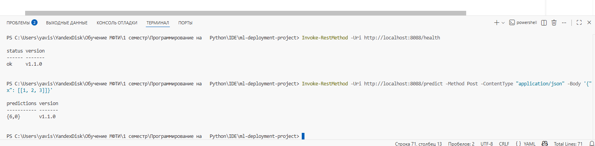

# 🚀 ML-Deployment-Project: Blue-Green Развертывание ML-Сервиса

Данный проект демонстрирует реализацию стратегии **Blue-Green Deployment** (Сине-Зеленое развертывание) для обновления сервиса машинного обучения с использованием **Docker Compose** и **Nginx** в качестве прокси/балансировщика.

Проект также включает настройку автоматического развертывания (Continuous Deployment) через **GitHub Actions**.

## ⚙️ Технологический Стек

* **Сервис:** Python / FastAPI (ML-сервис).
* **Контейнеризация:** Docker.
* **Оркестрация/Локальный деплой:** Docker Compose.
* **Прокси/Переключение трафика:** Nginx.
* **CI/CD:** GitHub Actions.

## 🎯 Стратегия Blue-Green Deployment

**Цель:** Обновление ML-сервиса с нулевым простоем (Zero Downtime).

1.  **Blue (Синяя) Среда (Старая версия v1.0.0):** Активно обслуживает трафик.
2.  **Green (Зеленая) Среда (Новая версия v1.1.0):** Развертывается параллельно, проходит тестирование, но не получает публичный трафик.
3.  **Переключение:** Nginx атомно (моментально) перенастраивается для направления всего входящего трафика на Green-среду (v1.1.0).
4.  **Очистка:** Blue-среда (v1.0.0) удаляется. Новая Green-среда становится новым Blue для следующего обновления.

## 💻 Локальный Запуск (Ручной Blue-Green)

Для запуска необходим установленный Docker и Docker Compose.

### 1. Запуск Начальной Среды (Blue: v1.0.0)

Запускаем Nginx и старую версию сервиса (Blue).

# Сборка образов (если не собраны)
docker build -t ml-service:v1.0.0 . 
docker build -t ml-service:v1.1.0 . 

# Запуск Blue-среды и Nginx
docker-compose -f docker-compose.blue.yml up -d

2. Развертывание Новой Версии (Green: v1.1.0)
Запускаем новый контейнер ml-service-green параллельно.

3. Переключение Трафика (Атомарный Switch)
Обновляем конфигурацию Nginx, чтобы проксировать трафик на порт, используемый Green-средой (например, 8001).

4. Верификация Финального Развертывания
Проверяем, что трафик перешел на v1.1.0:

5. Очистка Старой Среды
Останавливаем и удаляем старую Blue-среду (v1.0.0).

CI/CD через GitHub Actions
Пайплайн развертывания определен в файле .github/workflows/deploy.yml.

Триггер
Развертывание запускается автоматически при push в ветку main.

Этапы
Checkout: Клонирование репозитория.

Build and Push: Сборка Docker-образа с уникальным SHA-тегом и публикация в GitHub Container Registry (GHCR).

Deploy via API: Вызов внешнего API (https://api.cloudprovider/deploy) с использованием секрета CLOUD_TOKEN и нового тега образа. Этот шаг инициирует фактическое переключение Blue-Green на целевом сервере.

## ✅ Результаты Финальной Верификации (Скриншоты)

### 1. Проверка здоровья (Health Check)
Проверяем, что трафик успешно переключен на версию v1.1.0.

### 2. Проверка предсказания (Predict)
Проверяем, что ML-модель v1.1.0 работает и возвращает корректный результат.

Health Check: Проверка конечной точки CLOUD_ENDPOINT/health для верификации успешного развертывания новой версии.
